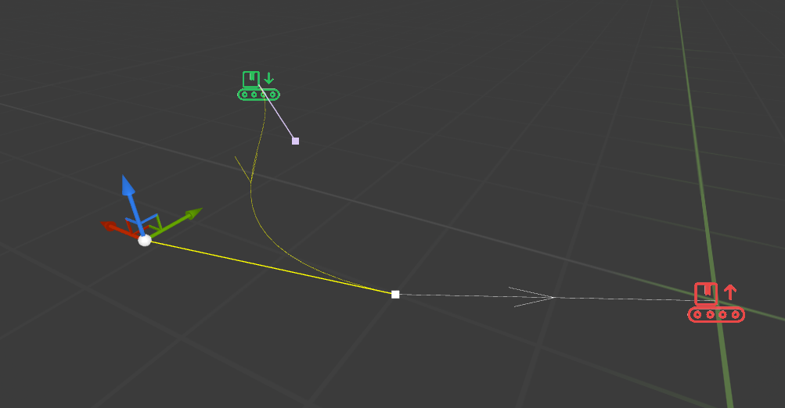
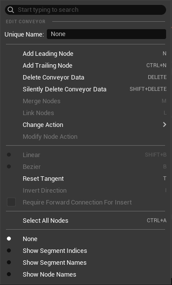
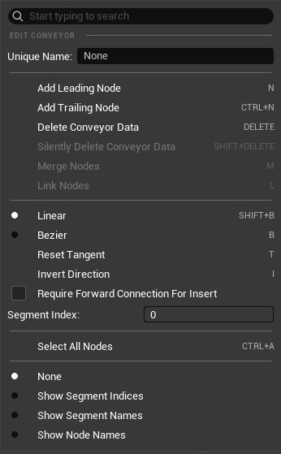

# Creating Conveyors

---

{: .important}
> There are **two** ways of creating and registering a conveyor layout. 
> The **first** way is by using a Conveyor Component.  
> The **second**, is by manually creating a `ConveyorComponentData` structure and registering it manually with the [Conveyor Subsystem]. 

---

## Using the Conveyor Component

---

To add a conveyor component to an actor, simply add a component as you would with any other, and then start with setting it up.

Firstly, there are some properties that can be set in the details panel:

| Property | Type | Description | Default Value |
|:---------|:-----|:------------|:--------------|
| Speed | float | The speed at which items will travel at on the conveyor. | 1 m/s |
| Item Spacing | float | The minimum spacing items need to keep between each other. Will be doubled for splitters to avoid one side blocking the others. | 25 cm |
| Item Rotation Speed | float | The speed at which items will follow their desired rotation | 360 deg/s |
| Item Rotation Type | Conveyor Item Rotation Type | Can be `Follow Segment` (The item orient itself towards the direction of motion), `Fixed Local` (Rotation is fixed  relative to the component) or `Fixed World` (Rotation is fixed relative to the world). | `Follow Segment` |
| Desired Item Rotation | Rotator | Only visible if rotation type is fixed. This is the rotation which the item will keep | `{0, 0, 0}` |

---

The way the component is created and edited *(shown below)* will look familiar with anyone who has worked with splines.

In the editor, you can manipulate nodes and segments just as if you were modifying a spline.

---

Right clicking on one or more nodes will show the following menu. This will change depending on what has been selected. By selecting one or more nodes you will get:

| Function Name | Desctiption   | Default Keybind |
|:--------------|:--------------|:----------------|
| Unique Name   | Give the selected node a unique name, which can be used to interact with after it has been registered.    | |
| Add Leading Node | Add a node in front of the selected one and connect them. | N |
| Add Trailing Node | Add a node behind the selected one and connect them. | CTRL+N |
| Delete Conveyor Data | Deletes nodes and any segment referencing them. | DELETE |
| Siltently Delete Conveyor Data | Deletes selected nodes and tries to reform segments to make up for the gap. | SHIFT+DELETE |
| Merge Nodes | Merges the selected nodes. The location will be the last one selected. | M |
| Link Nodes | Creates a segment between two or more nodes, following the order of selection | L |
| Change Action | Adds a [Conveyor Action] to the selected node. Will open a menu allowing you to select and modify its properties. | |
| Modify Node Action | Modifies the [Conveyor Action] of the selected node if it currently has one. | |
| Reset Tangent | Tries to reset all tangents to and from the selected nodes. | T |
| Select All Nodes | Selects all nodes in the component. | CTRL+A |

---

Right clicking on one or more segments will give the following context menu:

| Function Name | Desctiption   | Default Keybind |
|:--------------|:--------------|:----------------|
| Unique Name   | Give the selected segment a unique name, which can be used to interact with after it has been registered.    | |
| Add Leading Node | Add a node in front of the selected segment and connect them. | N |
| Add Trailing Node | Add a node behind the selected segment and connect them. | CTRL+N |
| Delete Conveyor Data | Deletes selected segments. | DELETE |
| Siltently Delete Conveyor Data | Deletes selected nodes and segments and tries to reform other segments to make up for the gap. | SHIFT+DELETE |
| Linear/Bezier | Changes the shape of the segment. Linear being a straight line and Bezier being a spline. | SHIFT+B or B |
| Reset Tangent | Tries to reset all tangents associated with the selected segments. | T |
| Invert Direction | Inverts the direction of selected segments | I |
| Require Forward Connection For Insert | Toggling this on will require the segment to have another segment in front of it in order to accept items. This is useful for splitters, making it so that unconnected outputs are not selected by the round-robin system. | |
| Segment Index | Modify this to set the order of round robin when splitting and merging. Lower index means first in queue. | |

---

At the bottom of the context menu is a selector for visualization modes. 

| Mode | Description |
|:-----|:------------|
|Show Segment Indices | Will display the index of each segment in the middle of it. This will affect the order of round robin when splitting and merging. Lower index means first in queue. |
| Show Segment Names | Displays segment names if set. These names are used to interact with the segment after it has been registered. |
| Show Node Names | Displays node names if set. These names are used to interact with the node after it has been registered. |

---

**The component then has some extra properties that define its behaviour.**

**Auto Register:** Having this on will automatically register the component with the [Conveyor Subsystem]. If false, you will need to manually call the `RegisterConveyor()` and `UnregisterConveyor()` functions. This is set to true by default.

**ClearComponentDataAfterRegistration:** Having this on will clear local registration data since it will no longer be needed. This frees up memory and improves performance. I suggest you keep this on unless you have a reason otherwise.

**Conveyor Handle:** Not found in the details panel, but is exposed on spawn and blueprint read-only. You can either spawn the component with a valid handle, which will link it to the simulation layer without re-registering, or if initially invalid, it will be validated on registration and can then be used to interact with the simulation layer via the [Conveyor Statics] blueprint function library.

{: .todo}
> add event dispatcher to function for when the registration is done.

Once the conveyor component has registered, the `On Conveyor Component Registered` event will be called. This can be overridden in blueprint.

---

## Manually Registering the Data

---

{: .note}
> This is more advanced and harder to set up than the component method, but allows for more modularity with the conveyors.

--- 

By creating a `Conveyor Component Data` struct, you can then call `Register Conveyor Component` and `Unregister Conveyor Component` via the [Conveyor Statics] library.

{: .todo}
> Add event dispatcher to function for when the registration is done.

{bp_node_impure, Register Conveyor Component, target_static Conveyor Statics, pin_transform Component Transform, pin_struct Component Data, pin_event On Register, out_pin_struct Out Handle}

The data struct is assembled just like it would in the component editor, but manually. The `Component Transform` parameter indicates the transform of the component in world space. The function returns the handle for the component, which can be used to interact with in the simulation layer and to unregister the component, using the `Unregister Conveyor Component` function, which will return true if the unregistration was successful.

{bp_node_impure, Unregister Component, target_static Conveyor Statics, pin_struct Handle}

---

[Conveyor Subsystem]: /AsyncConveyorPlugin/subsystem/
[Conveyor Component Data]: /AsyncConveyorPlugin/component/#manually-registering-the-data
[Item Payload]: /AsyncConveyorPlugin/item/#conveyor-item
[Conveyor Statics]: /AsyncConveyorPlugin/conveyor-statics/
[Conveyor Component]: /AsyncConveyorPlugin/component/
[Conveyor Action]: /AsyncConveyorPlugin/node-actions/
[Conveyor Actions]: /AsyncConveyorPlugin/node-actions/