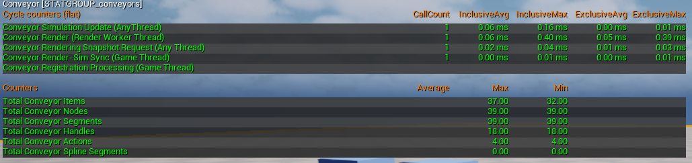

# Console Commands And Profiling

---

## Console Variables

| CVar Name               | Description                                                                                                                          | Default Value |
|-------------------------|--------------------------------------------------------------------------------------------------------------------------------------|---------------|
| Conveyor.Debug.Nodes    | Draw debug rendering for conveyor nodes.                                                                                             | false         |
| Conveyor.Debug.Segments | Draw debug rendering for conveyor segments.                                                                                          | false         |
| Conveyor.Debug.Items    | Draw debug rendering for conveyor items.                                                                                             | false         |
| Conveyor.WorkerSize     | **Advanced:** Changes how many nodes/connections a single worker in a ParallelFor is in charge of at most. Doesn't apply everywhere. | 1024          |

---

## Stat-Groups

By using the console command `stat conveyor`, you can get a summary of the performance of the conveyor system.

| Cycle Counter                       | Description                                                                                                                                                                                                                                                                                                                                                                                                                                                  |
|-------------------------------------|--------------------------------------------------------------------------------------------------------------------------------------------------------------------------------------------------------------------------------------------------------------------------------------------------------------------------------------------------------------------------------------------------------------------------------------------------------------|
| Conveyor Task Processing            | This is the time taken to process all actions which should perform their work on the Game Thread. This will be quite high on full-blueprint projects. Consider refactoring your blueprints to C++ if this becomes an issue. The time for this depends on the functionality given to actions (Game Thread ones) and their complexity.                                                                                                                         |
| Conveyor Simulation Update          | The update work to update the simulation layer off the game thread. If this is high, the items might have some visual lag to their movement. This generally does not affect actual FPS performance unless in [Plugin Settings] you enabled high priority tasks. In this case, threads from the conveyor simulation take over processing time from Game/Render/RHI threads and cause lag. This increases as number of segments/nodes/items/actions increases. |
| Conveyor Render                     | The **TOTAL** time taken to process rendering data. This is the sum across all threads. To get an actual estimate, divide the time by the call count. This is affected by the number of items. Each item type will have its own call. However, using Unreal Insights is suggested to actually figure out the actual time here.                                                                                                                               |
| Conveyor Rendering Snapshot Request | This is the time taken to set up the data to send to the rendering side of the system. Increases with the number of items, and has a non-linear relation with the `Conveyor.WorkerSize` CVar.                                                                                                                                                                                                                                                                |
| Conveyor Render-Sim Sync            | This is the time taken to actually transfer the data to the rendering side. This should usually be very small.                                                                                                                                                                                                                                                                                                                                               |

| Counter                        | Description                                                                                                           |
|--------------------------------|-----------------------------------------------------------------------------------------------------------------------|
| Total Conveyor Nodes           | The total number of nodes.                                                                                            |
| Total Conveyor Segments        | The total number of segments.                                                                                         |
| Total Conveyor Items           | The total number of items on belts.                                                                                   |
| Total Conveyor Handles         | The total number of components (both actor component and virtual component) which are registered.                     |
| Total Conveyor Actions         | The total number of conveyor actions which are registered. Includes stateless ones (although just once)               |
| Total Conveyor Spline Segments | The number of segments which have spline properties. Spline segments are more expensive to process than regular ones. |

The plugin also provides compatibility with [Unreal Insights](https://dev.epicgames.com/documentation/en-us/unreal-engine/unreal-engine-5-7-documentation/) to provide more detailed profiling information.

The goal of the plugin is to provide high-performance while maintaining a simple, modular and extensible API, which will fit any project. It has therefore been tested in multiple scenarios to ensure that the goal is reached. Below is an example of a stress test:

PC Specs and Environment:
- AMD Ryzen 7 5800X
- 32GB DDR4-2400 RAM
- Nvidia Geforce RTX 4070
- Windows 11
- Unreal Engine 5.7.1 in DebugGame build

In addition to the stress test, a [demo project] is available, which includes both stress test and a simple production chain to demonstrate some capabilities of the plugin:

A more in-depth explanation of the demo project can be found [here](/AsyncConveyorPlugin/demo-project/).

---

[Conveyor Subsystem]: /AsyncConveyorPlugin/subsystem/
[Conveyor Component Data]: /AsyncConveyorPlugin/component/#manually-registering-the-data
[Item Payload]: /AsyncConveyorPlugin/item/#conveyor-item
[Conveyor Statics]: /AsyncConveyorPlugin/conveyor-statics/
[Conveyor Component]: /AsyncConveyorPlugin/component/
[Conveyor Action]: /AsyncConveyorPlugin/node-actions/
[Conveyor Actions]: /AsyncConveyorPlugin/node-actions/
[Plugin Settings]: /AsyncConveyorPlugin/settings/
[Demo Project]: https://github.com/Theuntextured/AsyncConveyorPlugin/releases