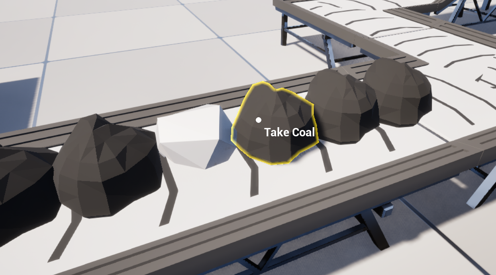

# Player

---

The player logic will not be explained thoroughly here, since most of it is irrelevant for this demo.

However, there are some features that are worth mentioning:
- Conveyor Item outlines
- Picking up Conveyor Items
- (Unimplemented in the demo) Placing Conveyor Items on belts

The player character blueprint can be found under `Content/Demo/Blueprints/Player/BP_PlayerCharacter`.

---

## Item Outlines

When hovering over a Conveyor Item, the item outline will be shown, hinting at the possibility of it being picked up.

The material side of the outline will not be covered, but the material is there for you to use for your own purposes if you wish to. Make sure to set `Custom Depth-Stencil Pass` to `Enabled with Stencil` in the project settings.

To find the origin of the blueprint logic for the item, you can find it under `Tick->StructureInteraction` (Collapsed nodes):

{bp 0orlx--o}

While it may look like a mess of spaghetti code (it is), the logic can be divided into:
- Trace from player camera forward to find a structure
- If a structure is found, get its conveyor component and its handle
- Use `Get Conveyor Item And Transform At Location` to find the item and its transform near the hit location, with a distance of 25 unreal units. Here, the first item found will be the one used.
- Check if the item is valid, and if so, set the outline transform to `Out Item Transform` and set it to be visible. Otherwise, invisible
  - Note the use of `Include Item Additional Transform` here. This makes it so the returned transform is exactly the transform of the mesh, without needing to do additional maths.

---

### Picking Up Items

The logic for picking up items is divided into two parts:
- The player character blueprint itself
- The `BP_StructureBase` blueprint logic (Found under `Content/Demo/Blueprints/Bases/BP_StructureBase`)

The player side, simply performs the line trace and calls the following on the hit structure:

{bp lqo0il-3}