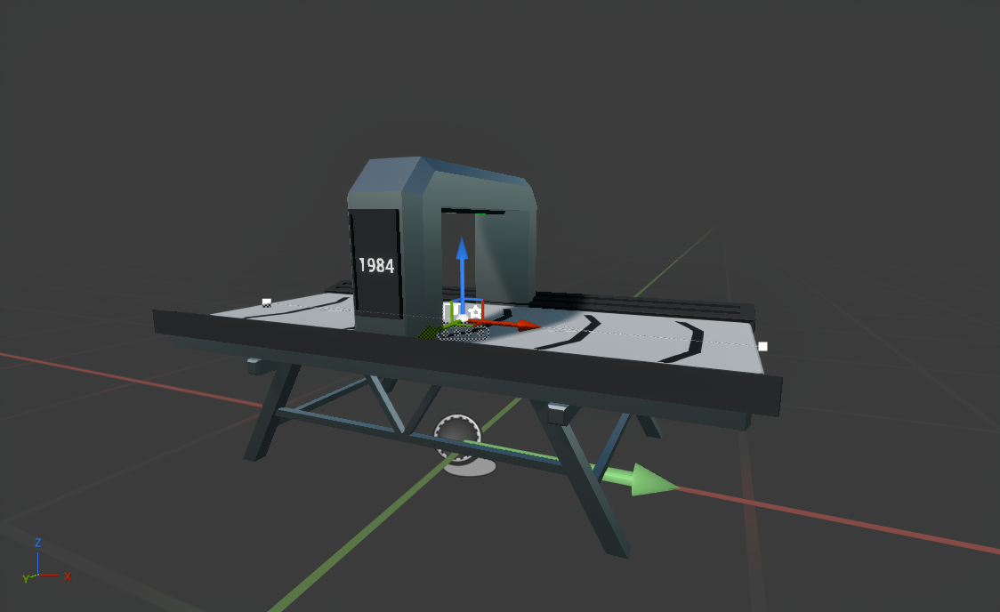

# Item Counter

---

The item counter will count the number of items that passed through it and display the number on a display.

The setup involves three nodes: one at each end and one in the middle under the "scanner" with a `BP_ItemCounterNodeAction` added to it.

The logic in `BP_ItemCounter` is not important here, as it simply sets up the UI for the display, linking it to the node action on registration.

For `BP_ItemCounterNodeAction`, the `Passive` behavior is checked, and therefore the `OnItemCrossed` event is implemented.

{bp xro_pjhb}

The logic here is straightforward: increment the counter by one when an item passes through. However, note that the `Count` property is marked as `Save Game` in the details panel. This allows for automatic saving of the node action.

