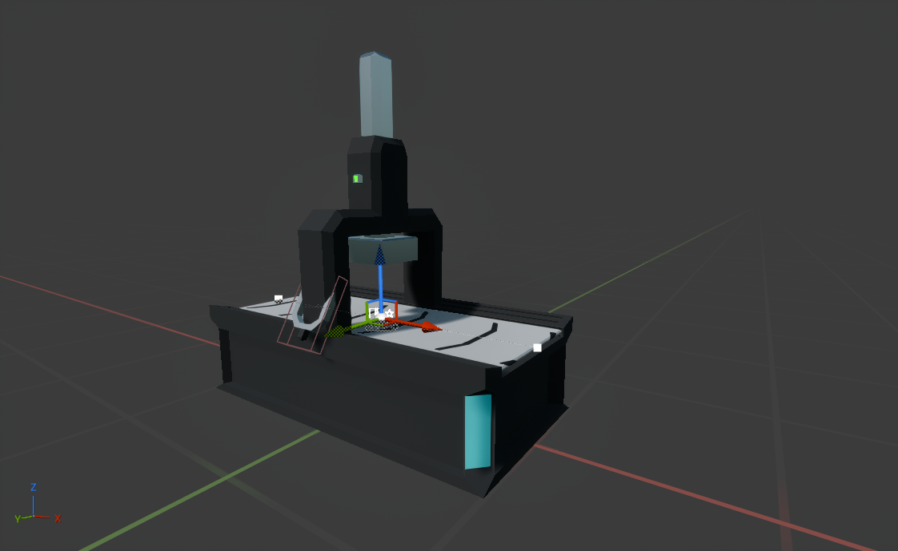

# Press

---

The press will convert steel into steel plates, while playing an animation for it. It can also be toggled on and off.

The animation logic will not be thoroughly discussed here, as it is not relevant to the purpose of this tutorial.

The setup is a skeletal mesh with a collision box attached to the lever. We then have the conveyor component composed of two nodes on each end and one in the middle with a `BP_PressNodeAction` on it.

{bp 9cwnp-8b}

{bp -h8nf392}

For `BP_Press` we have some events and functions of interest (the simplest ones are not shown above):
- `Tick`
  - Increases the crafting progress over time. 
  - `Start With Tick Enabled` is set to false, and is only on when an item is under it. 
  - This is discussed later
- `On Conveyor Registered`
  - Passes reference to self to the `BP_PressNodeAction`
- `Event Interact`
  - Toggles the press on and off if the hit component is the lever collision box by calling `Toggle`
- `Should Convert Item`
  - Called when an item has arrived under the press
  - Toggles tick and returns true if progress is greater than 0.5, which is when the press arm is fully down.
- `Toggle`
  - Switches the press on and off, by negating the `Is On` variable in `BP_Press`
- `Should Allow Item Pass Through`
  - Determines whether an item can pass through the arm. This will be when the item is not a valid crafting ingredient
  - It follows the following logic:
    - If the item is steel, return false. We need to press it
    - If crafting progress is 0, return true, since we must allow the invalid input to pass through, rather than starting a new cycle
    - If the crafting progress is 1, set it to zero, set tick enabled and return true, meaning that the steel plate has finished crafting.
    - Otherwise, return false, since we are in the middle of crafting.

As for `BP_PressNodeAction`, it should convert items, so we toggle the `Process` behavior on and implement the `ProcessItem` function:

{bp h_9bajuh}

The logic here is as follows:
- If the press reference is invalid, return (Allow the item to pass through)
- Ask the press if the item should pass through. If true, return true.
- Otherwise, ask the press if it should convert the item. If true, set the item's `Item Data` to `I_SteelPlate` and return false, since the item has not finished the crafting process.
- Otherwise simply return false, since the crafting is in progress.

As for the animation, we use `ABP_Press` to control it. It will blend the state of the lever based on the `Is On` variable, smoothing its movement. It sends this and the crafting progress to a control rig (`CR_Press`) that will also set the height of the arm depending on the progress, while using an easing function.

{: .note}
The implementation of the press in the demo is quite crude and inefficient, although simple. In your own project, I recommend not using tick, but using timers instead, and potentially disabling the node (not the node action) during crafting, preventing the system to spam the `ProcessItem` function with redundant calls.
