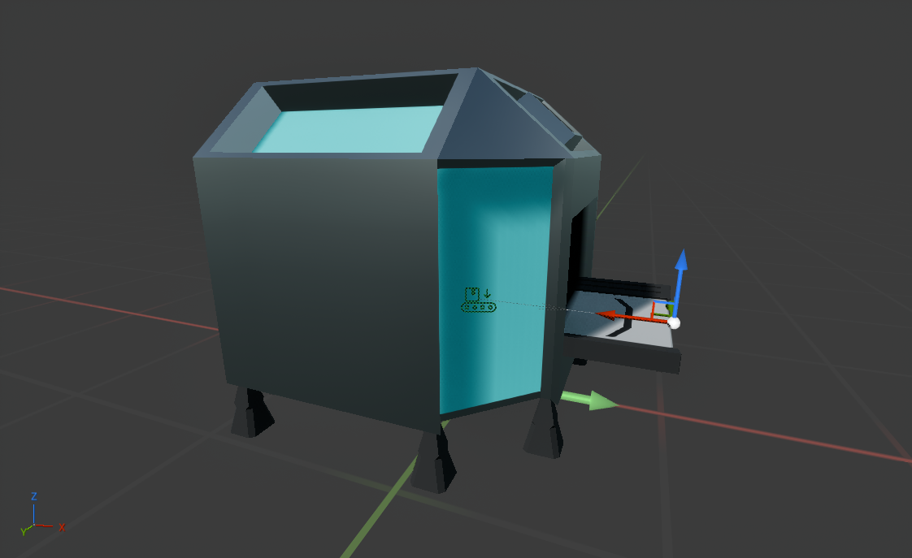

# Resource Extractor

---

The resource extractor spawns in iron ore and coal onto the conveyor with a cooldown time. Each item produced will have a random "quality" from 0 to 1. This is just an example of custom data the items can have.

The setup above is a single segment starting with a `BP_ResourceExtractorNodeAction`.

The extractor has no logic within it, and all the logic is handled by the `BP_ResourceExtractorNodeAction` which has the `Insert` behavior on and therefore implements the `Insert Item` function:

{bp u_1dk-ml}

The logic is as follows:
- If it is on cooldown, return an empty item.
- Set the `Is On Cooldown` variable to true and set a timer to reset it to false
- Return a conveyor item with a random quality from 0 to 1 and a random entry from the `Resources` array

