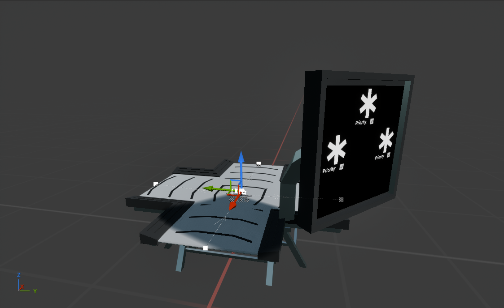

# Smart Splitter

---

The smart splitter has one input and three outputs. It will split items based on certain filters and priorities that can be set with a monitor it has attached.

Above is the setup: as discussed, it has an input segments and three output segments, with a `BP_SmartSplitterAction` in the central node.

{bp gvv7vza8}

The logic above is what happens when the conveyor component is registered. It simply passes a reference of itself to the action.

Note that the splitter has an array of `BP_Item` property (`Filters`) and an array of bools (`Priorities`). Both have length of 3: one for each output.

The `BP_SmartSplitterAction` should tell the conveyor system where to split each item to via index. We therefore enable the `Manual Output Round Robin` behavior and enable the `SelectRoundRobinOutput` function:

{bp o4zdmpd6}

The function might look intimidating and confusing, but what it does is quite simple:

- We take the node the action is on and get the item at index 0 in the "in segment", which is the input segment. We know that there is only 1 input here, so we simply get the input by getting the array of inputs and getting the first (and only) element
- We also get all out segments.
- We then have four passes:
  1. We check if any output has priority, and filter set to the item we got. If we find it, return its index. We also cache if we can insert (if there is the space) in each output.
  2. If not, we check if any output has priority, and filter unset. If we find it, return its index.
  3. If not, we check if any output has the filter set to our item. If we find it, return its index.
  4. If not, we check if any output has no filter set. If we find it, return its index.
  5. If nothing was found, return -1, meaning that the item will just wait.

The UI just sets the filters and priorities when buttons are used. Its exact functionality is not important here.
