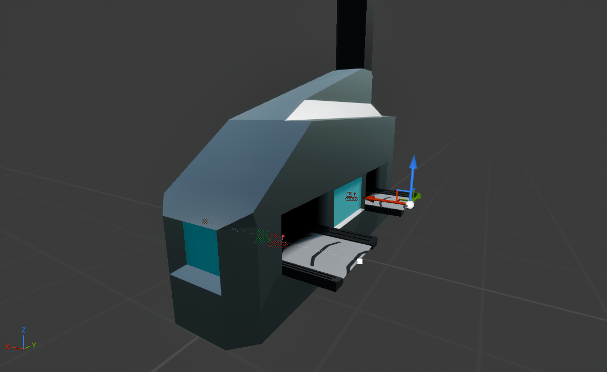

# Smelter

---

The smelter will input one coal and one iron ore and process them into one steel. It has one input for each internal input inventory slot and one output.

It has two segments with `BP_SmelterInput` actions in the ends as inputs, and a separate segment with `BP_SmelterOutput` action at the start as output.

The internal logic of how the crafting occurs is not relevant for this tutorial, but what you should know is that we have the following properties in `BP_Smelter`:

| Property Name     | Type                             | Description                                                                                       |
|-------------------|----------------------------------|---------------------------------------------------------------------------------------------------|
| Input Slot 1      | Conveyor Item                    | First input for the smelter. Can be either coal or iron ore. This is the internal inventory.      |
| Input Slot 2      | Conveyor Item                    | Second input for the smelter. Can be either coal or iron ore. This is the internal inventory.     |
| Output Slot       | Conveyor Item                    | Output for the smelter. Will contain the steel. This is still the internal inventory.             |
| Crafting Progress | Float                            | [0..1] Normalized crafting progress. Goes from 0 to 1, and when it hits 1, the steel is produced. |
| Crafting Speed    | Float                            | Higher speed means faster crafting. 0.1 by default, meaning 10 seconds per craft.                 |

When crafting happens, we take the average quality of the two inputs and use that as the quality of the output. (Example behavior)

{bp ik0zz-8x}

Above, we have tick behavior and post-registration for the smelter.

When the smelter's conveyor component has registered we pass a reference of it to all actions (And the UI which has the circular progress bar), and tell which input is assigned to the second slot.

For `BP_SmelterInput`, we must take the item off the belt and into the internal inventory, so we enable the `Process` action and implement `ProcessItem` function:

{bp 4mwqb4kt}

What we do is:
- Check if the smelter is valid, if not, return
- Check that the structure has space (By checking if the target slot is empty)
- We then insert the item into the internal inventory (by copying it)
- We then remove the item from the belt (by invalidating it)
- We return (`Should Item Proceed` is irrelevant here, since there is no more item, and in case of failure, we should return `false`, or the `ProcessItem` function will not be called again.)

For `BP_SmelterOutput`, we simply take the item from the internal inventory and put it into the output slot (There is no need to check for space on the belt, since the system does it for us).

{bp 2q8kr-94}

What we do is:
- Check if the smelter is valid, if not, return
- If the item in the output slot is invalid (no item there), we return
- Otherwise, we copy the item to a temporary variable, invalidate the one in the output, and return our temporary variable.

{: .note}
> The way this logic is implemented is not very efficient, but is the simplest way to do it.
> 
> In a real game, you should set input actions to inactive when there is an item in the slots (since we know that they should wait), and deactivate the output node when there is no output item. We do this using the `Set Active` function on the actions.
> 
> You should also NOT use the tick function for crafting, but use timers instead.
