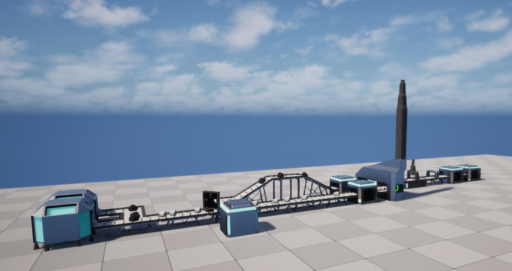
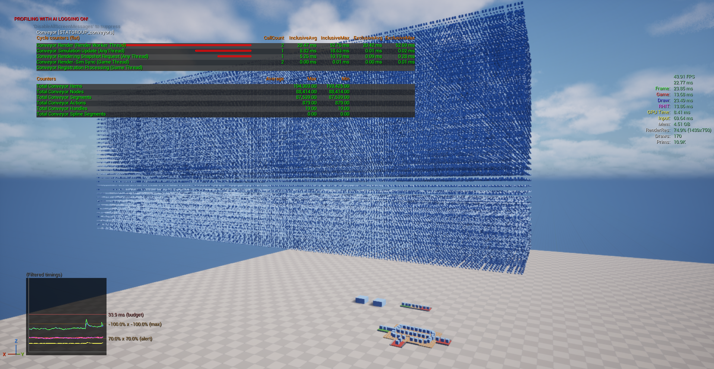
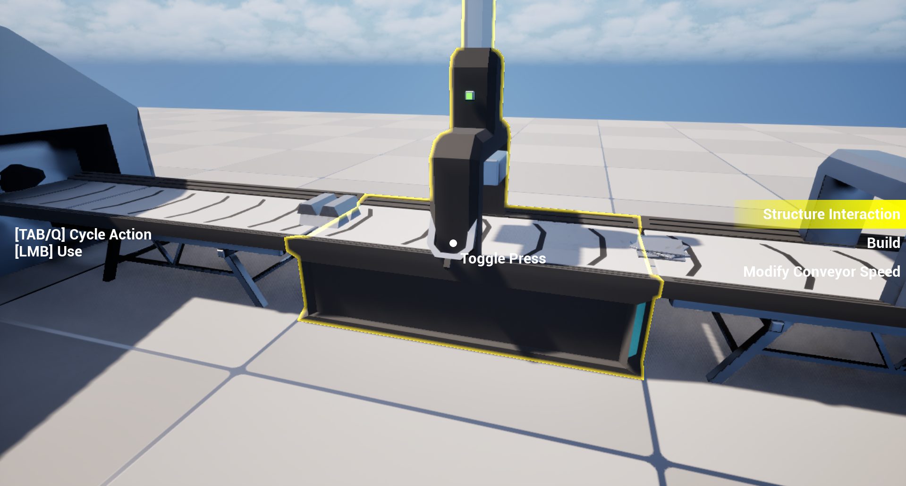
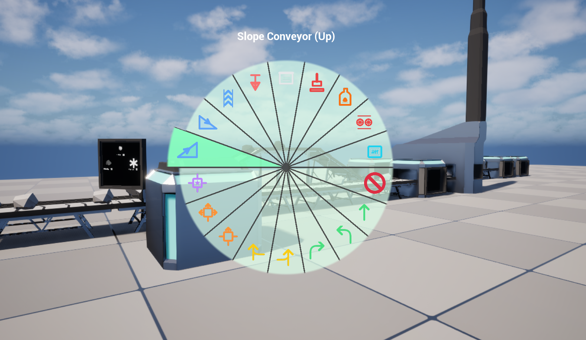

# Trying out the Project
{: .no_toc }
---

## In This Page:
{: .no_toc }

- TOC
{:toc}

---

When loading up the project you downloaded from [here](https://github.com/Theuntextured/AsyncConveyorPlugin/releases), you will have the `DemoMap` open, and the following folder structure:

```text
Content
└───Demo
    ├───Assets //Static assets, meaning item data assets, materials, meshes, and textures.
    │   ├───Items //Item data assets
    │   ├───Materials
    │   │   ├───ItemMaterials
    │   │   └───StructureMaterials
    │   │       └───ConveyorMaterialVariations
    │   ├───Meshes
    │   │   ├───Items
    │   │   └───StructureTypes
    │   └───Textures
    │       └───StructureIcons
    └───Blueprints //All the logic implemented in the demo project. No C++ code other than the plugin itself.
        ├───Bases //Contains base classes for structures and items, as well as the item payload struct.
        ├───Player //Player logic
        │   ├───Input
        │   └───UI
        ├───SaveGameLogic //Logic for saving and loading the game. Note that part of the code is in the DemoMap level blueprint.
        └───Structures //All the actual structures and their logic.
            ├───Common
            ├───Container
            ├───Crusher
            ├───ItemCounter
            ├───Press
            ├───ResourceExtractor
            ├───SimpleBelts
            ├───SmartSplitter
            └───Smelter
```
{: .tree-code }

{: .note}
> The `DemoMap` contains a level blueprint used for saving, loading, and registering structures.

I created all assets in the demo project (meshes and materials), and you are free to use them however you want, except:
- Coal by Mark Steelman [CC-BY] via Poly Pizza
- Black Rock by Cheryl Fong [CC-BY] via Poly Pizza

---

## What is Available?

In the level, you can find the following "production chain":



- The chain starts with [Resource Extractors], which generate iron ore and coal (mixed) and place them in the belts.
- The outputs from the extractors are merged into a single belt, and then split by a [Smart Splitter].
  - Coal and iron ore are separated and go through two [Containers], which act as buffers.
  - Any overflow is split off and sent into a [Crusher], which destroys the items.
- From the [Containers], iron ore and coal are sent into a [Smelter], which turns them into steel.
- The steel is sent into a [Press], which turns them into steel plates.
- The steel plates are sent into an [Item Counter], which counts the number of items which have passed through it.
- The final stop for the chain is the final two [Containers], which store the steel plates.

Holding `T` will speed up time.

Other than the production chain, you can find an actor (easy to find via the content browser) called `BP_StressTest`, which you can configure to stress test the plugin by spawning many belts which transport items.



---

## Playing Around With It

If you press play, you will have three modes:
- Structure Interaction
- Build
- Modify Conveyor Speed

You can switch mode using `TAB` to cycle forwards and `Q` to cycle backwards. You can see the current mode on the right side of the screen.

### Structure Interaction

This mode allows you to interact with the structures in the level. The following interactions are available by pressing `LMB`:
- Toggle press by interacting with the lever on it
- configure smart splitters
- Take item from belt (fallback)



### Build Mode

This mode allows you to build and destroy structures in the level. 

When pointing at an existing structure, you can use `RMB` to destroy it. 

To build a new structure, you should select it with the build menu, accessible by holding `Left Alt`, hovering over the desired structure, and releasing `Left Alt`.
When a structure has been selected, you can point at the ground and press `LMB` to build it, or use `MWheel` to rotate it.




### Modify Conveyor Speed

The final mode is straightforward. You point at a structure and use:
- `RMB` to half the conveyor speed
- `LMB` to double the conveyor speed


<style>
  .tree-code pre, .tree-code code {
    line-height: 1.15 !important;
    font-family: "Consolas", "Courier New", monospace !important;
    font-size: 16px !important;
  }
</style>


[Resource Extractors]: ../structures/resource-extractor/index.md
[Smart Splitter]: ../structures/smart-splitter/index.md
[Containers]: ../structures/container/index.md
[Crusher]: ../structures/crusher/index.md
[Smelter]: ../structures/smelter/index.md
[Press]: ../structures/press/index.md
[Item Counter]: ../structures/item-counter/index.md