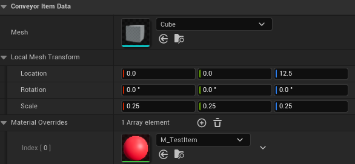

# Conveyor Items

---

{: .important}
> Items have two sides to them: `Conveyor Item` and `Conveyor Item Descriptor`.  
> Descriptors will describe an item type, while items will be the individual items running on conveyors.

---

## Conveyor Item Descriptor

Any UObject can be a descriptor, but it is suggested that data assets (`UDataAsset` or `UPrimaryDataAsset`) are used.

In order for an object to be considered a descriptor, it must implement `Conveyor Item Interface` and it must override the `GetItemDescriptor()` function.

Included in the plugin is a data asset type, `Conveyor Item Data`, which implements the logic in the simplest way possible.

The data required is a `Conveyor Item Descriptor` struct, which is composed as follows:

| Property             | Type                     | Description                                                                                               |
|:---------------------|:-------------------------|:----------------------------------------------------------------------------------------------------------|
| Item Name            | Name                     | The unique identifier for the item. If two items have the same name, they will be taken as the same item. |
| Mesh                 | Static Mesh              | The visual mesh for the item.                                                                             |
| Local Mesh Transform | Transform                | The local transform of the mesh.                                                                          | 
| Material Overrides   | Material Interface Array | (Optional) Material overrides for the mesh.                                                               |

You can manually register item types with the system using the `Register Conveyor Item Type` function from the [Conveyor Statics] library. 
This will allow the system to keep the object reference alive for the duration of the level-s lifetime.
While this is not required, it is recommended to do so to avoid garbage collection issues, especially if the item types is dynamically generated (not a data asset).

{bp_node_impure, Register Conveyor Item Type, target_static Conveyor Statics, pin_interface Item Type, out_pin_bool Return Value}

The function returns true if the item type was successfully registered, false otherwise (if the passed object does not implement the required interface or if the object is invalid).

## Conveyor Item

Conveyor items are simple structures. They store a `Conveyor Item Interface` object reference (in the form of a `TScriptInterface`) and a `Payload` which you can use to stora any custom data you need in the form of a [FInstancedStruct].

Creating and invalidating items is as simple as setting the `Item Data` property to whatever you want, null if you want to invalidate the item (Or use the `Invalidate Conveyor Item` function from the [Conveyor Statics] library).

{: .warning}
> Item payloads will not be seen by Unreal's Garbage Collection, so you shouldn't store UObject references in them unless you are keeping them alive elsewhere.

---

[Conveyor Subsystem]: /AsyncConveyorPlugin/subsystem/
[Conveyor Component Data]: /AsyncConveyorPlugin/component/#manually-registering-the-data
[Item Payload]: /AsyncConveyorPlugin/item/#conveyor-item
[Conveyor Statics]: /AsyncConveyorPlugin/conveyor-statics/
[Conveyor Component]: /AsyncConveyorPlugin/component/
[Conveyor Action]: /AsyncConveyorPlugin/node-actions/
[Conveyor Actions]: /AsyncConveyorPlugin/node-actions/
[FInstancedStruct]: https://dev.epicgames.com/documentation/en-us/unreal-engine/BlueprintAPI/Utilities/InstancedStruct
